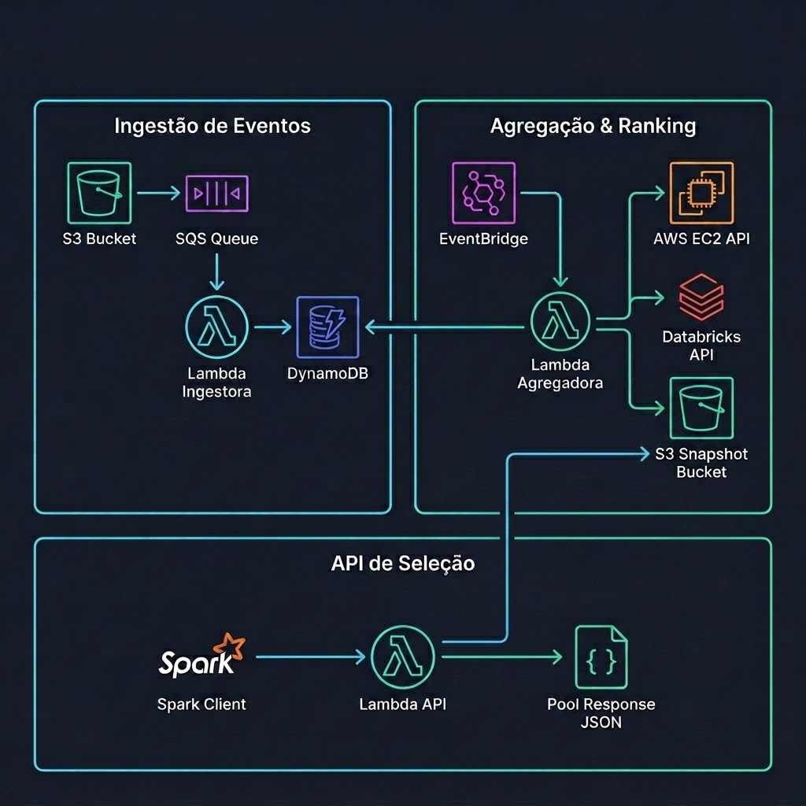

# Arquitetura do Seletor de Pools Spark

API para recomendação de instâncias Spot otimizadas para jobs Spark, combinando histórico de término de jobs, capacidade da Databricks e Spot Placement Score da AWS.

Status: **Implementado**. Rastreabilidade completa em [requisitos.md](requisitos.md) e limitações na [Seção 12](#12-limites-conhecidos).

---

## 1. O que o serviço faz

Instâncias Spot oferecem até 90% de desconto na AWS, mas podem ser revogadas a qualquer momento (`SPOT_INSTANCE_TERMINATION`), matando jobs em execução. A AWS publica apenas uma probabilidade ampla por AZ; o serviço combina essa informação com o histórico recente de términos por pool e dados em tempo real da Databricks.

### 1.1 Economia de Nuvem (Spot vs DBU)

* **Custo do Spark:** Licença de Software (DBU Databricks) + Computação (EC2 AWS). O DBU tem preço fixo; instâncias Spot reduzem o custo de EC2 em **70% a 90%**.
* **Evita Desperdício de DBU:** Se um job de 45 minutos é revogado no minuto 40, todo o tempo de DBU e EC2 é jogado fora.
* **Geração de Valor:** Maximiza o uso de Spot com segurança e minimiza a perda de progresso e licenças DBU.

---

## 2. Como funciona

A arquitetura separa o processamento em background (Escrita) da consulta em tempo real (Leitura). O caminho de leitura **não faz chamadas de rede externas**, garantindo latência **< 5ms**.

### 2.0 Visão Geral da Arquitetura



Os três componentes são Lambdas isoladas via IAM. Compartilham apenas o DynamoDB (contadores) e o S3 (snapshot).

### 2.1 Fluxo 1: Ingestão de Eventos (Assíncrono)

Ao término de um job Spark, o log de execução é salvo no S3 e notifica a fila SQS. A **Lambda Ingestora** consome as mensagens em lotes (até 1.000 msgs ou a cada 20s), classifica os eventos (`SUCCESS`, `SPOT_TERMINATION`, etc.) e incrementa os contadores no DynamoDB agrupados por minuto e pool.

### 2.2 Fluxo 2: Agregação & Ranking (Cron 1 min)

O EventBridge Scheduler dispara a **Lambda Agregadora** a cada minuto. Ela lê os contadores do DynamoDB, a capacidade dos pools de instâncias (Databricks/EMR), os tipos de máquina e os Spot Placement Scores da AWS EC2, publicando um snapshot compactado `snapshot.json.gz` no S3 com o ranking pré-calculado.

### 2.3 Fluxo 3: API de Seleção (Síncrono — ~5ms)

Ao receber requisições em `GET /get-pools`, a **Lambda API** carrega o snapshot do S3 para a memória RAM (com cache local de até 30s). Ela executa os filtros de busca e o Thompson Sampling em milissegundos sem realizar nenhuma chamada externa de rede ou banco durante a requisição.

### Por que pré-calcular?

| Métrica | Calcular no Request (ex. Athena) | Pré-calcular (Arquitetura Atual) |
| --- | --- | --- |
| Latência | Segundos | ~5 milissegundos |
| Custo de Cálculo | Proporcional aos TBs lidos por request | Fixo (1 execução/min da Agregadora) |
| Pico de 100 Jobs | 100 consultas pesadas concorrentes | Zero consultas adicionais |

---

## 3. Como o pool é escolhido

O timestamp `finished_at` em UTC define a idade e peso de cada observação.

### 3.1 Classificação dos Eventos

| Evento | Peso | Por quê |
| --- | --- | --- |
| `SUCCESS` | Positivo (1.0) | Capacidade confirmada. |
| `SPOT_INSTANCE_TERMINATION` | Negativo (1.0) | Queda de Spot (escassez). |
| `TIMED_OUT` | Parcial (0.5) | Ambíguo: pode ser escassez ou job lento. |
| `SPARK_EXECUTION_ERROR` | Descartado | Bug no código do job, não penaliza o pool. |

### 3.2 Dois Fatores Independentes

O score final combina **Escassez da AZ** (mercado Spot) e **Adequação do Job ao Tipo** (recursos de máquina).

| Fator | Fonte de Aprendizado | Meia-vida | Raciocínio |
| --- | --- | --- | --- |
| **Escassez da AZ** | Todos os jobs na AZ | 20 minutos | Dinâmico: o mercado Spot muda em minutos. |
| **Adequação do Job** | Histórico por `job_id` | 14 dias | Estático: o perfil do código do job muda devagar. |

#### Exemplo Numérico do Decaimento Exponencial (`fator = 0.5 ^ (tempo / meia_vida)`)

**Fator de AZ (meia-vida = 20 min)** — 10 falhas às 14:00:

| Momento | Tempo decorrido | Fator | Falhas ponderadas |
| --- | --- | --- | --- |
| 14:00 | 0 min | `0.5^(0/20)` = 1.00 | **10.0 falhas** |
| 14:20 | 20 min | `0.5^(20/20)` = 0.50 | **5.0 falhas** |
| 15:00 | 60 min | `0.5^(60/20)` = 0.125 | **1.25 falhas** |

**Fator de Job Fit (meia-vida = 14 dias)** — 5 falhas do job `etl-pedidos`:

| Momento | Tempo decorrido | Fator | Falhas ponderadas |
| --- | --- | --- | --- |
| Dia 0 | 0 dias | `0.5^(0/14)` = 1.00 | **5.0 falhas** |
| Dia 7 | 7 dias | `0.5^(7/14)` = 0.71 | **3.54 falhas** |
| Dia 14 | 14 dias | `0.5^(14/14)` = 0.50 | **2.5 falhas** |

*Nota: Se usassem a mesma meia-vida de 20 min, um job diário esqueceria seu histórico em 24h (`0.5^72 ≈ 0`).*

### 3.3 Três Fontes de Dados

| Pergunta | Fonte | Natureza | Frequência |
| --- | --- | --- | --- |
| Esse pool costuma aguentar? | Histórico S3 / DynamoDB | Reativa (passado) | A cada evento |
| Esse pool tem espaço agora? | API Databricks Instance Pools | Estado atual (presente) | 1 min |
| Essa AZ vai aguentar? | AWS EC2 Spot Placement Score | Preditiva (futuro) | 5 min |

#### Detalhes das Fontes Externas

* **Databricks API:** Fornece `state` (filtra pools parados), `free_slots` (espaço livre), `idle_count` (instâncias quentes, sem risco spot) e `SPOT_WITH_FALLBACK` (bônus configurável no score).
* **AWS Spot Placement Score (`GetSpotPlacementScores`):** Avalia disponibilidade de 1 a 10 por AZ e perfil.
  * *Restrições da AWS:* Exige consulta por perfil (mínimo 3 tipos de máquina), usa p90 de capacidade e atualiza a cada 5 min para evitar throttling da AWS.

### 3.4 Perfil Dinâmico de Instâncias

Em vez de tabelas fixas, a Agregadora executa `DescribeInstanceTypes` 1x/dia para calcular a razão **Memória por vCPU** (igual ao Vantage), classificando em `memory`, `compute`, `general` ou `storage`. Novas famílias da AWS são suportadas sem novo deploy.

### 3.5 Thompson Sampling & Capacity Caps

Para evitar que todos os jobs vão para o mesmo pool (efeito manada) e permitir exploração de pools novos:

1. **Thompson Sampling:** Sorteia um ponto dentro da distribuição Beta (`Beta(alpha, beta)`) de cada pool. Pools com poucas amostras têm faixas largas e podem ganhar eventualmente.
   * *Zero Scipy:* Distribuição Beta implementada em Python puro (~80 linhas via fração continuada de Lentz e inversa por bisseção), reduzindo ~50MB no pacote da Lambda e 2s no cold start.
2. **Capacity Caps:** Limita a fatia máxima de tráfego de cada pool com base na capacidade livre informada pela Databricks. Se o melhor pool estiver cheio, o tráfego escorre para as alternativas.

| Pool | Estimativa | Faixa | Amostras | Comportamento |
| --- | --- | --- | --- | --- |
| `pool-r6.xlarge-us-east-1a` | 0,94 | 0,90 a 0,97 | 210 | Vence quase sempre. |
| `pool-r6.xlarge-us-east-1c` | 0,88 | 0,55 a 0,99 | 4 | Ganha eventualmente (exploração). |
| `pool-r6.xlarge-us-east-1b` | 0,41 | 0,33 a 0,50 | 150 | Evitado com alta confiança. |

* **Job Novo:** Herda o prior médio do perfil declarado (`profile=memory`). Com 3 falhas, o score cai de 0.9 para ~0.36.

---

## 4. Disponibilidade e Degradação

O serviço adota resiliência Serverless nativa (AWS Lambda, S3, SQS e DynamoDB multi-AZ) e uma política de **degradação graciosa** (nunca falha com 503 se houver alternativa):

| Situação | Comportamento da API |
| --- | --- |
| Snapshot indisponível | Retorna último snapshot da RAM com `stale: true`. |
| Snapshot expirado (>5 min) | Responde normalmente, emite métrica e dispara alarme CloudWatch. |
| Nenhum snapshot existente | Retorna lista estática de `FALLBACK_POOLS` com `degraded: true`. |
| Filtro sem correspondência | Retorna HTTP `404` explícito. |
| Parâmetro inválido | Retorna HTTP `422` (validação Pydantic). |
| Falha na API Databricks | Segue sem dados de capacidade (usa apenas histórico). |

---

## 5. Contrato da API (`GET /get-pools`)

Desenvolvido em **Python 3.13** (Amazon Linux 2023, suporte no Lambda até jun/2029). Endpoint principal: `GET /get-pools` (com alias `/get-pool`).

### Parâmetros de Query

| Parâmetro | Tipo | Descrição |
| --- | --- | --- |
| `job_id` | string | Identificador do job para ativar histórico específico. |
| `instance_types` | string | Tipos de instância permitidos (separados por vírgula). |
| `family` | string | Prefixo da família (ex: `r6`). |
| `profile` | string | Perfil (`memory`, `compute`, `general`, `storage`). |
| `availability_zones` | string | AZs restritas para localidade de dados. |
| `exclude_pools` | string | Pools a ignorar (para retry). |
| `min_samples` | int | Amostras mínimas exigidas (desliga exploração). |
| `strategy` | string | `sampling` (default) ou `greedy` (determinístico). |
| `alternatives` | int | Qtd de alternativas de reserva (default: 2). |
| `seed` | int | Semente aleatória para testes/reprodutibilidade. |

### Exemplo de Resposta JSON

```json
{
  "pool_id": "pool-r6.xlarge-us-east-1c",
  "instance_type": "r6.xlarge",
  "availability_zone": "us-east-1c",
  "score": 0.94,
  "credible_interval": [0.89, 0.97],
  "evidence": {
    "az_samples": 210,
    "job_samples": 12,
    "source": "job_history"
  },
  "capacity": {
    "free_slots": 34,
    "idle_instances": 6,
    "falls_back_to_on_demand": false
  },
  "az_outlook": {
    "spot_placement_score": 8,
    "target_capacity": 20,
    "age_seconds": 142
  },
  "alternatives": [
    { "pool_id": "pool-r6.xlarge-us-east-1a", "score": 0.91 }
  ],
  "snapshot": { "age_seconds": 23, "stale": false },
  "degraded": false
}
```

### Códigos de Resposta HTTP

| Código | Condição | Significado |
| --- | --- | --- |
| **200 OK** | Sucesso | Pool recomendado com evidência (pode ter `stale: true`). |
| **200 OK** | Fallback ativado | Respondido via lista estática de fallback (`degraded: true`). |
| **404 Not Found** | Filtro sem resultado | Nenhum pool atende aos critérios informados. |
| **422 Unprocessable Entity** | Erro de parâmetro | Erro de validação gerado pelo FastAPI/Pydantic. |
| **503 Service Unavailable** | Sem dados e sem fallback | Snapshot indisponível e `FALLBACK_POOLS` nã## 6. Escolhas de Ferramentas e Infraestrutura

### 6.1 Framework Web & Execução

| Camada | Escolha | Motivo | Alternativas Descartadas |
| --- | --- | --- | --- |
| **Framework** | **FastAPI** | Validação Pydantic e OpenAPI automático | Flask (sem validação), Django (pesado), Handler puro (sem docs/rotas) |
| **Computação** | **AWS Lambda** | Escala a zero, sem custo ocioso e escala instantânea | Fargate/EC2 (custo fixo + autoscaling lento), EKS (complexidade excessiva) |
| **Entrada HTTP** | **Function URL** | Zero custo por request, autenticação via IAM | API Gateway (cobrança por req), ALB (custo fixo por hora) |

### 6.2 Armazenamento & Banco de Dados

| Componente | Escolha | Motivo | Alternativas Descartadas |
| --- | --- | --- | --- |
| **Contadores de Eventos** | **DynamoDB** | Escrita condicional (deduplicação SQS), incremento atômico e TTL nativo | PostgreSQL/Redis (custo fixo, conexões em Lambda), Athena (lento para escrita) |
| **Snapshot de Ranking** | **S3 + Gzip** | Leitura massiva paralela, cache de RAM de 30s absorve latência | DynamoDB (teto de IOPS em partição única durante cold start) |

### 6.3 Tooling & Projeto

* **Gerenciador de Dependências:** `uv` (rápido, trava dependências transitivas).
* **Agendamento:** `EventBridge Scheduler` (disparo Serverless a cada 1 min).
* **IaC & CI/CD:** `Terraform` (gerencia IAM, SQS, S3, Lambdas) + `GitHub Actions` com `OIDC` (sem keys estáticas).
* **Qualidade & Testes:** `pytest`, `Hypothesis` (baseado em propriedades), `moto` (mock AWS), `ruff` e `mypy`.

---

## 7. Escala e Capacidade

O gargalo do sistema não é volume de dados, mas **concorrência de leitura no pico** (ex: 2.000 jobs iniciando juntos).

### Cenário de Referência: 2.000 Jobs Simultâneos

| Componente | Carga Estimada | Status de Resiliência |
| --- | --- | --- |
| **Lambda API** | 2.000 req/s @ 5ms (~10 instâncias concorrentes) | Seguro (sem I/O no request) |
| **Fila SQS & Ingestor** | 33 eventos/s (50k jobs/dia) | Seguro (processamento em batch) |
| **Leitura do Snapshot** | 2.000 leituras simultâneas | Seguro (cache RAM 30s + S3 gzip) |
| **Fontes Externas** | 1 req/min (Databricks), 1 req/5min (AWS SPS) | Fixo (independe do volume de jobs) |

### Otimizações de Escala Aplicadas

1. **Pré-agregação no Ingestor:** SQS consome em lote e consolida contadores em RAM antes de atualizar o DynamoDB.
2. **Agregadora Incremental O(1):** `novo = anterior × decaimento + delta`. Evita reprocessar todo o histórico.

---

## 8. Custo Estimado (~1,5M requests/mês)

| Item | Arquitetura Atual (Serverless) | Alternativa Tradicional (Containers + ALB) |
| --- | --- | --- |
| Computação API | < US$ 1,00 | > US$ 15,00 |
| Entrada HTTP | US$ 0,00 (Function URL) | ~US$ 16,00 (ALB) |
| Ingestão, Agregação & S3 | ~US$ 1,00 | ~US$ 1,00 |
| CloudWatch Logs & Métricas | US$ 2,00 - US$ 5,00 | US$ 2,00 - US$ 5,00 |
| **TOTAL MENSAL** | **< US$ 10,00** | **> US$ 35,00 (paga sem uso)** |

---

## 9. Estrutura do Código

```
src/pool_selection/
├── domain/                  # Python puro, sem dependência de AWS
│   ├── pool.py              # Vocabulário: PoolId, InstanceType, AvailabilityZone, Profile
│   ├── events.py            # Classificação de eventos (SUCCESS → +1, SPOT_TERMINATION → -1)
│   ├── catalog.py           # Classificação de perfil por razão memória/vCPU
│   ├── statistics.py        # Distribuição Beta pura em Python (sem scipy, ~80 linhas)
│   ├── scoring.py           # Fatores, Evidence com decaimento, Capacity, PlacementForecast
│   ├── snapshot.py          # Snapshot completo (pools + job_fit + profile_fit + catalog)
│   ├── filters.py           # Filtros do cliente (instance_types, family, profile, AZs)
│   └── selection.py         # Thompson Sampling, Capacity Caps, Allocate, Draw
│
├── ports/                   # Interfaces (contratos abstratos)
│   ├── counters.py          # Interface do store de contadores
│   ├── snapshots.py         # Interface do store de snapshots
│   └── sources.py           # Interface das fontes externas (Databricks, EC2)
│
├── adapters/                # Implementações concretas (AWS, Databricks)
│   ├── s3_snapshots.py      # Lê/escreve snapshot no S3
│   ├── file_snapshots.py    # Lê snapshot de arquivo local (dev)
│   ├── dynamodb_counters.py # Lê/escreve contadores no DynamoDB
│   ├── ec2_placement.py     # Consulta Spot Placement Score da AWS
│   ├── ec2_catalog.py       # Consulta DescribeInstanceTypes da AWS
│   ├── databricks_pools.py  # Consulta API de pools do Databricks
│   ├── secrets.py           # Lê token do Secrets Manager
│   └── memory.py            # Implementação em memória (testes)
│
├── entrypoints/             # Pontos de entrada (Lambda handlers)
│   ├── api/
│   │   ├── handler.py       # Mangum (adapta Lambda → FastAPI)
│   │   ├── app.py           # FastAPI app, rotas /get-pools e /get-pool
│   │   ├── schemas.py       # Pydantic schemas (PoolRecommendation, Evidence, etc.)
│   │   └── snapshot_cache.py # Cache em memória com TTL de 30s
│   ├── ingestor/
│   │   └── handler.py       # Consome SQS, classifica eventos, atualiza DynamoDB
│   └── aggregator/
│       └── handler.py       # Combina DynamoDB + Databricks + EC2, publica snapshot
│
├── config.py                # Settings via variáveis de ambiente
└── observability.py         # Logging estruturado e métricas CloudWatch

infra/                       # Terraform
├── versions.tf              # Provider AWS, backend S3
├── variables.tf             # 14 variáveis configuráveis
├── storage.tf               # 2 buckets S3 + tabela DynamoDB
├── queue.tf                 # Fila SQS + DLQ + notificação S3→SQS
├── iam.tf                   # 4 IAM Roles (menor privilégio)
├── lambda.tf                # 3 Lambdas + EventBridge Scheduler
├── monitoring.tf            # 6 alarmes CloudWatch + 1 dashboard
├── outputs.tf               # URLs e ARNs expostos
└── envs/                    # staging.tfvars / production.tfvars

tools/gen_events.py          # Gerador de eventos sintéticos
tests/                       # unit, propriedades, contrato, integração, simulação, carga
```

* **Desenvolvimento Local:** Pode ser executado em **1 comando** via **Docker** (`docker compose up` ou `make demo`) ou nativamente via **uv** (`make dev`). Para simulação de serviços AWS completos (LocalStack), utilize `make dev-aws`.

---

## 10. CI/CD e Qualidade

### Estratégia de Testes

| Nível | Escopo | Ferramenta |
| --- | --- | --- |
| **Unitário** | Decaimento, Thompson Sampling, Filtros | `pytest` |
| **Propriedade** | Invariantes (scores entre 0 e 1, filtros estritos) | `Hypothesis` |
| **Integração** | DynamoDB, S3, deduplicação de batch SQS | `moto` |
| **Contrato** | Endpoint HTTP e esquemas JSON | `TestClient` |
| **Simulação** | Migração de recomendação após queda de AZ | `pytest` |
| **Carga** | Validação de concorrência e p99 | `k6` |

* **Gate de Cobertura:** Mínimo de 85% no código de domínio.

### Deploy Canary Automatizado

```mermaid
sequenceDiagram
    autonumber
    participant Dev as Desenvolvedor
    participant GH as GitHub Actions
    participant AWS as AWS Cloud

    Dev->>GH: git push main
    GH->>GH: make package

    rect rgb(45, 80, 120)
    Note over GH,AWS: Staging
    GH->>AWS: terraform apply - staging
    GH->>AWS: Smoke test na API real
    end

    rect rgb(80, 45, 45)
    Note over GH,AWS: Producao - requer aprovacao
    GH->>AWS: terraform apply - production
    GH->>AWS: Publica nova versao da Lambda
    GH->>AWS: Direciona 10% para nova versao
    GH->>GH: Espera 5 minutos monitorando alarmes
    alt Alarme disparou
        GH->>AWS: Rollback - 100% na versao anterior
    else Tudo verde
        GH->>AWS: Promove para 100%
    end
    end
```



---

## 11. Observabilidade

Métricas publicadas via **CloudWatch EMF (Embedded Metric Format)** sem custo extra de chamadas de API:

* **Latência:** p50 e p99 da API.
* **Saúde da Agregadora:** Alarme disparado se a idade do snapshot exceder 5 minutos.
* **Taxa de Fallback:** Percentual de respostas servidas em modo degradado (`degraded: true`).
* **Distribuição de Pools:** Métrica com dimensão `Pool` para monitorar efeito manada.
* **Acurácia Preditiva:** Divergência entre Spot Placement Score da AWS e falhas reais observadas.

---

## 12. Limitações Conhecidas

1. **Efeito Manada em Picos Extremos:** O teto de capacidade limita a proporção de tráfego enviada a cada pool, mas não controla o volume total absoluto de jobs simultâneos no mesmo segundo (exige escrita assíncrona no request para balanço global).
2. **Granularidade do Placement Score:** O Spot Placement Score exige pelo menos 3 tipos de máquina por consulta; logo, mede a disponibilidade da AZ/Perfil, cabendo ao histórico diferenciar os pools específicos dentro daquela AZ.
3. **Falta de Métricas de Recursos por Job:** O evento indica o término do job, mas não a quantidade exata de executores/memória exigidos; o ajuste de capacidade é feito dinamicamente por histórico e perfil.

---

## Glossário

| Termo | Conceito |
| --- | --- |
| **Function URL** | Endpoint HTTPS direto na AWS Lambda sem custo de API Gateway. |
| **TTL (Time-To-Live)** | Expiração automática de itens no DynamoDB para janela deslizante sem cron jobs. |
| **Thompson Sampling** | Algoritmo bandit Bayesian que equilibra exploração (aprender pools novos) e exploração (usar os melhores). |
| **At-least-once** | Garantia de entrega do SQS onde mensagens podem ser duplicadas, exigindo deduplicação atômica no banco. |
| **OIDC no CI** | Autenticação federada entre GitHub Actions e AWS sem chaves estáticas de acesso. |
| **Cold Start** | Primeira execução da Lambda parada, que inicializa o runtime e módulos em RAM. |
