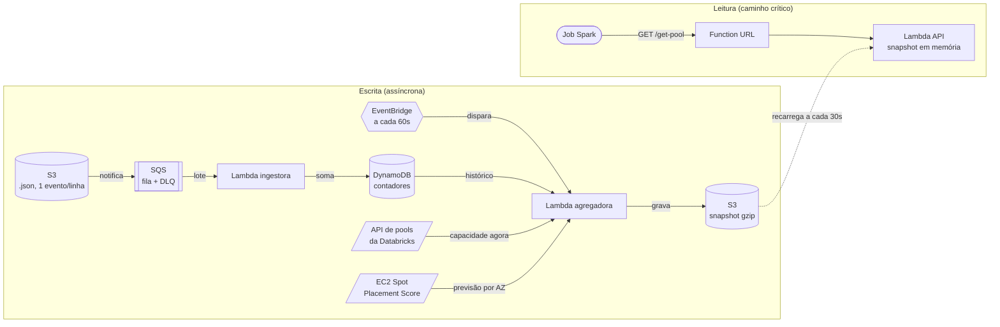

# Arquitetura do seletor de pools Spark

Uma API que responde, a qualquer hora, em qual pool de instâncias spot um job Spark tem
mais chance de rodar até o fim. Este documento explica o desenho, o que foi escolhido e o
que foi descartado. A rastreabilidade requisito a requisito está em
[requisitos.md](requisitos.md).

Status: plano aprovado, implementação não iniciada.

---

## 1. O que o serviço faz

Instância spot é capacidade ociosa da AWS vendida barato, que pode ser retomada a
qualquer momento. A disponibilidade muda por zona (AZ), por tipo de instância e por hora
do dia. Quando um pool fica sem capacidade, os jobs que estão nele morrem.

Ninguém publica quanta capacidade existe em cada pool. A AWS publica algo mais grosso, uma
probabilidade por AZ, e os eventos de job dão o que falta: se jobs no
`pool-r6.xlarge-us-east-1c` começaram a morrer com `SPOT_INSTANCE_TERMINATION` nos últimos
vinte minutos, aquela AZ está apertada agora, e isso a AWS não conta. O serviço junta as
duas coisas.

É um pipeline pequeno de três camadas: ingestão dos eventos que caem no S3, agregação por
pool, e uma API que serve o resultado. O que muda tudo é a latência exigida na ponta. Um
dashboard aceita cinco segundos. Um job que está subindo, não.

---

## 2. Como funciona

Existem dois caminhos, e eles nunca se cruzam em tempo de request. É isso que faz a API
ser rápida e barata ao mesmo tempo.



Quando um job termina, a plataforma escreve a linha no S3. O S3 avisa a fila, a fila
entrega em lote para a ingestora, que classifica cada evento e soma contadores por pool e
por minuto. Uma vez por minuto, a agregadora lê esses contadores, junta com a capacidade
atual dos pools e com a previsão de spot da AWS, calcula o score de cada pool e grava um
único arquivo comprimido com o ranking inteiro.

Quando um job pergunta, a API já tem esse arquivo em memória, recarregado no máximo
trinta segundos atrás. Ela filtra os candidatos, sorteia e responde. Na maior parte das
vezes, nenhuma chamada de rede acontece.

### Por que pré-calcular

A alternativa intuitiva é consultar o S3 na hora, com Athena. Funciona e é o desenho
errado.

| | Calcular no request | Pré-calcular |
|---|---|---|
| Latência | segundos | milissegundos |
| Custo do cálculo | por TB lido, cresce com o tráfego | fixo, uma execução por minuto |
| 100 jobs no pico | 100 queries iguais | zero queries a mais |

O que torna isso possível é o tamanho do resultado. São algumas dezenas de pools com
quatro números cada. O ranking inteiro cabe em poucos kilobytes, então cabe na memória da
API.

---

## 3. Como o pool é escolhido

O `finished_at` do evento é o relógio do modelo: é dele que sai a idade de cada
observação e, portanto, o peso dela. Vem em UTC no formato ISO e é normalizado na
ingestão.

### Nem toda falha fala sobre o pool

| Evento | Peso | Por quê |
|---|---|---|
| `SUCCESS` | positivo | Havia capacidade. |
| `SPOT_INSTANCE_TERMINATION` | negativo | É o que queremos evitar. |
| `TIMED_OUT` | parcial | Ambíguo: pode ser escassez, pode ser job lento. |
| `SPARK_EXECUTION_ERROR` | descartado | Bug do job. Penalizaria pools só porque times com código instável os usam. |

### Dois fatores, não um

O `pool_id` carrega duas informações independentes. `pool-r6.xlarge-us-east-1c` diz onde
(a AZ) e o quê (o tipo de instância). São perguntas diferentes: a AZ determina escassez,
que é sobre o mercado spot e não tem relação com o job; o tipo determina se o job cabe
ali, que é sobre o job e não sobre o mercado.

O score final multiplica os dois, e cada um aprende de uma fonte diferente:

| Fator | Aprende com | Meia-vida | Por quê |
|---|---|---|---|
| Escassez da AZ | todos os jobs | 20 minutos | Muita evidência, e o mercado muda em horas. |
| Adequação do job ao tipo | histórico daquele `job_id` | 2 semanas | Pouca evidência, mas só precisa detectar diferença grosseira. É propriedade do código do job, não muda em horas. |

As meias-vidas diferentes são essenciais. Com 20 minutos nos dois, um job diário
esqueceria de si mesmo entre uma execução e outra e nunca aprenderia nada sobre si.

Isso responde à pergunta do job pesado sem precisar de nenhum campo novo no evento. Não
sabemos quantos executores o job usou nem quanto tempo levou, e não precisamos: se
`meu-etl-pesado` sobrevive em `r6.4xlarge` e morre em `r6.xlarge`, o histórico dele conta
isso direto, sem explicar o mecanismo.

### Três fontes, não uma

O histórico de falhas responde "esse pool costuma aguentar?", e só isso. Ele não sabe se o
pool tem espaço neste instante, nem se a AZ vai apertar na próxima hora. São três
perguntas, e as outras duas têm resposta direta, sem precisar inferir de nada:

| Pergunta | Fonte | Natureza |
|---|---|---|
| Esse pool costuma aguentar? | Eventos no S3 | Reativa, por pool |
| Esse pool tem espaço agora? | API de pools da Databricks | Estado atual, por pool |
| Essa AZ vai aguentar? | Spot placement score da AWS | Preditiva, por AZ e perfil |

As três entram na agregadora, fora do caminho de request. Nenhuma delas é chamada quando
um job pergunta.

#### Capacidade agora

O termo "pool de instâncias" é vocabulário da Databricks, e a API de instance pools expõe
o estado atual de cada pool, numa consulta por minuto:

| Campo | Uso no modelo |
|---|---|
| `state` | Pool `STOPPED` ou `DELETED` sai da lista de candidatos. Sem isso, o serviço pode recomendar um pool que não existe mais, porque o histórico de eventos não sabe que ele morreu. |
| `max_capacity` menos `used_count` e `pending_used_count` | Espaço livre agora. Um pool cheio não deve ser recomendado por melhor que seja o histórico dele. O campo é opcional na Databricks: pool sem teto declarado entra sem esse ajuste. |
| `idle_count` | Instâncias já quentes. Elas não precisam ser adquiridas no mercado spot, então não correm o risco que estamos modelando. Pool com folga ociosa é mais seguro do que o histórico sugere. |
| `aws_attributes.availability` | `SPOT_WITH_FALLBACK` cai para on-demand quando falta spot, então quase não falha por escassez. O perfil de risco é outro e o score precisa refletir isso. |
| `node_type_id` e `zone_id` | Tipo e AZ de forma autoritativa, em vez de parseados do nome do pool. |

A lista de candidatos passa a vir da API, não do histórico. Pool novo, que nunca apareceu
em nenhum evento, hoje seria invisível.

Um pool `SPOT_WITH_FALLBACK` é mais seguro e mais caro, porque a economia do spot some
justamente quando ele é acionado. O bônus de score dele é configurável e nasce pequeno:
o serviço existe para reduzir falha sem jogar fora a razão de usar spot.

Se o ambiente não for Databricks, essa fonte não existe e o serviço volta a operar só com
o histórico, que é o desenho original. O modelo trata a capacidade como fator opcional
justamente por isso.

#### O sinal que chega antes da falha

Histórico e capacidade são as duas fontes olhando para trás e para agora. Falta olhar
para frente, e essa é a diferença entre um serviço que reage e um que antecipa: sem
previsão, a primeira notícia de que uma AZ apertou é um job de alguém morrendo nela.

A AWS publica exatamente esse número. `GetSpotPlacementScores` devolve, de 1 a 10, quão
provável é conseguir uma quantidade de capacidade spot em cada AZ agora, e com
`SingleAvailabilityZone=true` a resposta vem por AZ, que é a granularidade do problema.
Não custa nada.

Três restrições da API decidem como ela é usada, e ignorar qualquer uma delas faz o sinal
chegar errado em vez de não chegar:

| Restrição | O que ela força no desenho |
|---|---|
| Menos de três tipos de instância diferentes devolve score baixo por definição | Um pool tem um tipo só, então pool nunca pode ser pontuado direto. A consulta é por perfil, com os tipos daquele perfil na região, e o resultado alimenta o fator de AZ. |
| O score depende da capacidade que você pergunta: 10 para 10 instâncias não é 10 para 1.000 | A capacidade alvo é o p90 de instâncias que os pools daquele perfil de fato usam, tirado dos dados da Databricks, e não uma constante escolhida no chute. |
| A AWS pode barrar configurações de consulta novas dentro de 24 horas se o padrão fugir do uso pretendido; repetir configuração já usada é livre | O conjunto de consultas é fixo e pequeno, uma por perfil, e o refresh é a cada 5 minutos em vez de a cada minuto. Capacidade spot muda em horas, então 5 minutos não perde nada e mantém o uso dentro do previsto. |

O encaixe no modelo já existia. O fator de AZ sempre foi "sobre o mercado, não sobre o
job", e o placement score é exatamente uma medida de mercado por AZ. Ele entra como prior
desse fator: enquanto não há falha recente, a previsão manda; quando o histórico começa a
contradizer o score, a evidência observada ganha, porque ela é sobre os pools reais e o
score é sobre a região.

O que a AWS não promete importa tanto quanto o que ela promete. O score é recomendação,
não garantia de capacidade, e um score alto por AZ assume alocação `capacity-optimized`
concentrada em uma AZ, que é como um pool funciona de qualquer jeito. Se a chamada falhar,
o fator fica neutro e o serviço volta a ser reativo, sem quebrar.

### De onde sai o perfil de um tipo de instância

O filtro `profile` precisa saber que `r6.xlarge` é memória e `c6.xlarge` é CPU. Uma
tabela fixa no código resolveria e envelheceria: cada família nova da AWS viraria um
deploy.

Em vez disso, a agregadora consulta `DescribeInstanceTypes` uma vez por dia e classifica
pela razão memória por vCPU, com armazenamento local como desempate. É a mesma conta que
o [Vantage](https://instances.vantage.sh/) mostra, feita a partir da fonte primária, e
funciona para família que ainda não existe. Tipo que a API não reconhece fica com perfil
desconhecido e continua acessível por `instance_types` e `family`, em vez de sumir do
catálogo. O resultado entra no snapshot, então o
caminho de request continua sem I/O.

### Por que sortear em vez de pegar o melhor

Cada pool vira uma faixa, não um número. O centro é a taxa de sucesso estimada e a
largura é a incerteza, que depende de quanta evidência existe. A cada request o serviço
sorteia um ponto dentro da faixa de cada candidato e devolve o maior. É Thompson
Sampling.

| Pool | Estimativa | Faixa | Amostras | No sorteio |
|---|---|---|---|---|
| `pool-r6.xlarge-us-east-1a` | 0,94 | 0,90 a 0,97 | 210 | Vence quase sempre. |
| `pool-r6.xlarge-us-east-1c` | 0,88 | 0,55 a 0,99 | 4 | Às vezes ganha, o que o traz de volta. |
| `pool-r6.xlarge-us-east-1b` | 0,41 | 0,33 a 0,50 | 150 | Evitado com confiança. |

Três problemas caem juntos:

- Pool que parou de ser recomendado nunca mais gera dado e morreria para sempre no
  ranking. A recomendação de hoje determina os dados de amanhã, e a faixa larga quebra
  esse ciclo.
- Um pico de duzentos jobs não vai todo para o mesmo pool, porque cada request sorteia de
  novo. Espalhamento sem estado compartilhado e sem escrita no caminho crítico.
- Um pool com 1 sucesso em 1 tentativa não vence um com 200 em 210.

O preço aparece em dois lugares. A resposta deixa de ser reprodutível, então a
aleatoriedade é injetada, recebe semente fixa em teste, e o endpoint aceita
`strategy=greedy` para quem precisar de resposta determinística. E o custo de explorar cai
inteiro no dono do job que foi cobaia, nunca distribuído, então o endpoint aceita
`min_samples` para job crítico exigir evidência e a resposta expõe de onde veio a
recomendação.

### Job novo erra, e se corrige em três execuções

Um job que nunca rodou não começa cego. O fator de AZ já nasce calibrado, porque veio de
todos os outros jobs. Falta só saber se ele precisa de máquina maior, dentro da família
que o cliente já restringiu, e para isso o prior vem do perfil declarado: um job novo que
pede `profile=memory` herda o comportamento médio dos outros jobs de memória.

A correção é rápida porque falha é sinal forte e sucesso é sinal fraco. Partindo de 0,9,
três falhas naquele tipo de instância derrubam o score para perto de 0,36. Job diário
aprende em menos de uma semana.

No lançamento nem isso acontece: o bucket já tem meses de evento, então dá para
reprocessar o histórico e nascer com o modelo treinado para todos os jobs existentes.
Cold start passa a valer só para job genuinamente novo.

---

## 4. Disponibilidade e degradação

Este serviço fica no caminho de submissão de job. Se ele falhar, trava pipeline de gente.
Por isso a disponibilidade vem de duas frentes.

A primeira é não ter nada próprio para cair. Lambda, S3, SQS e DynamoDB são gerenciados e
já rodam replicados entre as AZs da região, sem configuração nenhuma. Não há instância
para monitorar, não há load balancer, não há VPC, e o caminho de leitura quase nunca faz
chamada de rede. Menos peça significa menos coisa que pode falhar.

A segunda é o serviço nunca devolver erro se puder evitar:

| Situação | Resposta |
|---|---|
| Snapshot indisponível | Serve o último que tem em memória, marca `stale: true`. |
| Snapshot velho demais | Continua respondendo, emite métrica e dispara alarme. |
| Nenhum snapshot | Lista estática de pools conhecidos, escolha uniforme, `degraded: true`. |
| Filtro não casa com nada | 404 com mensagem explícita. |
| Parâmetro inválido | 422, gerado pela validação. |

O job vai ser submetido de qualquer jeito. Um palpite informado é melhor que um 503.

---

## 5. Contrato do endpoint

Python 3.13, acima do mínimo 3.9 pedido. É o runtime de Lambda com prazo de depreciação
mais longo (junho de 2029) e roda em Amazon Linux 2023. Python 3.11 foi a primeira
escolha e caiu na revisão: ainda vive em Amazon Linux 2, cujo fim de vida foi em junho de
2026, e é depreciado no Lambda em junho de 2027.

`GET /get-pool`, todos os parâmetros opcionais e combináveis.

| Parâmetro | Efeito |
|---|---|
| `job_id` | Ativa o histórico daquele job. Sem ele, só o fator de AZ é usado. |
| `instance_types` | Lista explícita, ex. `r6.xlarge,r6.2xlarge`. |
| `family` | Prefixo de família, ex. `r6`. |
| `profile` | `memory`, `compute`, `general` ou `storage`. |
| `availability_zones` | Restringe AZs, para jobs com localidade de dados. |
| `exclude_pools` | Pools a ignorar, útil para retry. |
| `min_samples` | Exige evidência mínima. Desliga a exploração para job crítico. |
| `strategy` | `sampling` (padrão) ou `greedy`. |
| `alternatives` | Quantos pools de reserva retornar, padrão 2. |

```json
{
  "pool_id": "pool-r6.xlarge-us-east-1c",
  "instance_type": "r6.xlarge",
  "availability_zone": "us-east-1c",
  "score": 0.94,
  "credible_interval": [0.89, 0.97],
  "evidence": {
    "az_samples": 210,
    "job_samples": 12,
    "source": "job_history"
  },
  "capacity": {
    "free_slots": 34,
    "idle_instances": 6,
    "falls_back_to_on_demand": false
  },
  "az_outlook": {
    "spot_placement_score": 8,
    "target_capacity": 20,
    "age_seconds": 142
  },
  "alternatives": [
    { "pool_id": "pool-r6.xlarge-us-east-1a", "score": 0.91 }
  ],
  "snapshot": { "age_seconds": 23, "stale": false },
  "degraded": false
}
```

Devolver alternativas é deliberado: quem perder instância no pool sugerido faz fallback
sem uma segunda chamada. O campo `evidence.source` diz se a recomendação veio do
histórico do job, do perfil, ou de nada, o que permite ao time saber quando é palpite. E
`az_outlook` mostra a previsão da AWS para aquela AZ separada do histórico observado, com
a capacidade alvo que gerou o número, porque score de placement sem a capacidade
perguntada não quer dizer nada.

A documentação interativa do endpoint é o OpenAPI gerado automaticamente pelo FastAPI,
em `/docs`.

---

## 6. Escolhas de ferramenta

### 6.1 Framework web

| Opção | Veredito |
|---|---|
| **FastAPI** (escolhida) | Os filtros de query são a parte chata desse endpoint, e o Pydantic resolve validação e mensagem de erro sem código manual. O OpenAPI vem de graça. Custo: o tempo de import pesa no cold start. |
| Flask | Sem validação embutida. Eu escreveria à mão o parsing dos filtros e a documentação. |
| Django REST | ORM e ciclo de vida que este serviço não usa. Import pesado demais para Lambda. |
| Litestar | Boa, mas com ecossistema menor. A familiaridade do time vale mais que a diferença de benchmark, que some diante do custo de rede. |
| Handler puro | Menor cold start possível, mas perde validação, documentação e a possibilidade de rodar local com Uvicorn. |

### 6.2 Onde a API roda

| Opção | Veredito |
|---|---|
| **Lambda** (escolhida) | Baseline baixo com picos imprevisíveis é onde serverless ganha. Vai de zero a centenas de execuções simultâneas em segundos e não cobra nas horas ociosas. Custo: cold start. |
| ECS Fargate | Sem cold start, mas o autoscaling reage em 30 a 60 segundos e o pico acontece mais rápido. Piso de custo pago mesmo de madrugada. |
| EC2 com Auto Scaling | Mesma limitação de reação, com patch de sistema operacional por cima. |
| EKS | Só compensa se a empresa já roda tudo em Kubernetes e o serviço herdar deploy e observabilidade. Infra demais para um arquivo de poucos kilobytes. |

### 6.3 Porta de entrada HTTP

| Opção | Veredito |
|---|---|
| **Function URL** (escolhida) | Não cobra por request, e autenticação IAM basta para um serviço interno. Uma peça a menos. |
| API Gateway HTTP API | Cobra por request e adiciona um salto. Vale se precisar de throttling por consumidor ou domínio próprio. É o próximo passo se o serviço for exposto para fora. |
| ALB | Piso de custo por hora, cobrado o tempo todo, o que anula a vantagem de escalar a zero. |

### 6.4 Banco de dados

A escolha ficou em aberto, inclusive a de não usar banco. O escolhido é o **DynamoDB**,
um NoSQL chave-valor, e ele guarda os contadores de eventos por pool e por minuto.

Banco é necessário por dois motivos. Os contadores precisam sobreviver entre execuções de
funções que não compartilham memória. E a entrega do SQS é at-least-once, então a mesma
mensagem pode chegar duas vezes: sem escrita condicional por chave de evento, um lote
reentregue contaria a mesma falha de novo e afundaria um pool que estava bem.

Não é SQL porque não há nada relacional: sem join, sem transação entre entidades, sem
query analítica no caminho quente. O acesso é sempre "me dá o contador desta chave" e
"soma um neste contador".

| Opção | Veredito |
|---|---|
| **DynamoDB** (escolhida) | Incremento atômico e escrita condicional, que são exatamente as operações da ingestão, e TTL nativo, que implementa a janela deslizante sem job de limpeza. Escala a zero. |
| Nenhum banco, estado só no snapshot | O decaimento é incremental, então a agregadora poderia guardar o próprio estado no arquivo que já publica. Some uma peça, mas some também a deduplicação por evento, e um reprocessamento vira número errado. |
| PostgreSQL (RDS) | Nada aqui é relacional. Custo fixo por hora e conexões que combinam mal com Lambda. |
| Redis (ElastiCache) | Piso de custo fixo e vive em VPC, o que adiciona interface de rede ao cold start. |
| Athena sobre o S3 | Cobrança por volume escaneado, e a agregadora roda 1.440 vezes ao dia. Continua sendo a ferramenta certa para análise offline. |

### 6.5 Onde guardar o snapshot

Decisão separada, porque o snapshot não é banco: é um arquivo reconstruído do zero a cada
minuto, que pode ser perdido sem perda de dado. O padrão de acesso também é o oposto,
escrito uma vez por minuto e lido por toda instância da API que sobe fria.

| Opção | Veredito |
|---|---|
| **S3 com gzip** (escolhida) | Milhares de leituras por segundo por prefixo, e o gzip derruba o arquivo para poucos kilobytes. A latência é mais variável que a do DynamoDB, mas o cache de 30 segundos absorve isso. |
| DynamoDB | Foi a primeira escolha e caiu na revisão de escala. O snapshot é um item só, logo uma partição só, e partição tem teto de leitura por segundo. Cold start em massa chega perto desse teto no pico. Ver [seção 7](#7-escala). |
| Embutir no pacote de deploy | Leitura instantânea, mas exigiria um deploy por minuto. |

### 6.6 Ferramentas de projeto

| Decisão | Escolha | Por que não as outras |
|---|---|---|
| Dependências | **uv** | pip com requirements não trava dependências transitivas. Poetry resolve, mas é bem mais lento no CI. |
| Ingestão dos eventos | **Notificação S3 e SQS** | Sem a fila não há DLQ nem controle de concorrência, e uma rajada de arquivos vira uma rajada de invocações. Kinesis seria certo se a origem fosse stream, mas a origem é arquivo. |
| Agendamento | **EventBridge Scheduler** | Cron em container exigiria container ligado o tempo todo. Airflow é peça grande demais para um job de um minuto. |
| Infra como código | **Terraform** | SAM só descreve serverless, e a infra aqui tem fila, tabela, agendamento e alarme. CDK exigiria infra em outra linguagem. |
| CI/CD | **GitHub Actions com OIDC** | GitLab CI e CircleCI são equivalentes; segue onde o repositório vive. O ponto não negociável é OIDC em vez de chave estática. |
| Testes | **pytest, Hypothesis, moto** | Só teste de exemplo não cobre bem um componente estatístico, daí as propriedades. LocalStack fica para o ambiente de dev; nos testes, moto é mais rápido. |
| Qualidade | **ruff e mypy** | Black, flake8 e isort fazem o mesmo em três ferramentas e mais devagar. Tipagem estrita só no domínio, onde tem valor. |

---

## 7. Escala

O volume que este serviço vê não é o volume de dados da empresa. Um job que processa dez
terabytes gera um evento. O que importa é quantos jobs terminam por dia.

Cinquenta mil jobs por dia dão 0,6 evento por segundo. Mesmo com dois mil jobs terminando
no mesmo minuto, são 33 por segundo, que uma fila SQS nem registra. O eixo de risco não é
volume de dados, é concorrência de leitura no pico.

Cenário de referência: dois mil jobs disparados no mesmo instante.

| Componente | Carga | Situação |
|---|---|---|
| Lambda da API | 2.000 req/s a 5 ms dão cerca de 10 execuções simultâneas | Folga enorme. É o caminho sem I/O que faz essa conta ser trivial. |
| Fila e ingestão | 33 eventos por segundo | Irrelevante. |
| Escrita dos contadores | Poucas escritas por lote, com pré-agregação | Segura. Sem pré-agregação, o ingestor vira o gargalo. |
| Leitura do snapshot | Até 2.000 leituras do mesmo arquivo, vindas de cold start | Era aqui que quebrava. Resolvido com S3 e gzip. |
| Agregadora | Independe do tráfego | Segura, depois de virar incremental. |
| Chamadas às fontes externas | 1 por minuto na Databricks, 1 a cada 5 minutos por perfil na AWS | Constantes, e nenhuma delas cresce com o número de jobs. |

### Duas mudanças que a escala exige

Pré-agregação no ingestor: o SQS entrega em lote, e somar as mensagens em memória antes
de escrever transforma milhares de escritas em poucas, uma por par de pool e minuto.

Agregadora incremental: ler a janela de seis horas a cada minuto significa, com trezentos
pools, cerca de cento e oito mil itens por execução, 1.440 vezes ao dia. Decaimento
exponencial é incremental por natureza, então
`novo = anterior × decaimento + delta do último minuto` transforma isso em O(1).

### Antes do primeiro pico

- Solicitar aumento da cota de concorrência do Lambda e validar com teste de carga. O
  limite padrão barra pico súbito por cota, não por capacidade técnica.
- Conferir o modo do DynamoDB. Sob demanda dobra a capacidade conforme cresce, mas barra
  pico bem acima do anterior. Para pico no mesmo horário todo dia, o certo é capacidade
  provisionada com auto scaling agendado.
- Medir o cold start de verdade, com o pacote final.
- Conferir o limite de capacidade alvo do placement score. Ele é calculado a partir do
  uso recente de spot da conta, então uma conta com pouco histórico recebe um limite baixo
  por padrão e o número volta rebaixado sem erro nenhum. Vale validar contra o uso real
  antes de confiar no sinal.
- Alarme na idade do snapshot e na taxa de resposta degradada, que são os sinais que
  aparecem antes de o usuário perceber.

---

## 8. Custo

Ordem de grandeza para 1,5 milhão de requests por mês. Os valores mudam por região e ao
longo do tempo; a diferença entre os desenhos, não.

| Item | Escolhido | Se fosse container |
|---|---|---|
| Computação da API | menos de US$ 1 | a partir de US$ 15 |
| Porta de entrada | US$ 0 | cerca de US$ 16 de ALB |
| Ingestão, agregação e armazenamento | cerca de US$ 1 | cerca de US$ 1 |
| Logs e métricas | US$ 2 a US$ 5 | US$ 2 a US$ 5 |
| **Total** | **abaixo de US$ 10** | **acima de US$ 35, pago sem tráfego** |

O valor importa menos que o formato da curva: o custo do cálculo é fixo, sempre uma
execução por minuto. Se o número de jobs multiplicar por cem, a arquitetura não muda.

---

## 9. O que será construído

O miolo estatístico é Python puro, sem `boto3` e sem FastAPI, então roda em teste em
milissegundos sem simular AWS. As bordas ficam finas o bastante para poucos testes de
integração.

```
src/pool_selection/
├── domain/              # Python puro, sem AWS
│   ├── pool.py          # parse de pool-r6.xlarge-us-east-1c
│   ├── events.py        # classificação de status e reason
│   ├── scoring.py       # os dois fatores e o decaimento
│   ├── selection.py     # o sorteio
│   └── filters.py       # família, perfil, AZ, exclusões
├── ports/               # interfaces com o mundo externo
├── adapters/            # dynamodb, s3, memória
└── entrypoints/
    ├── api/             # app FastAPI
    ├── ingestor/        # consome a fila
    └── aggregator/      # gera o snapshot

infra/                   # Terraform
tools/gen_events.py      # gerador de eventos sintéticos
tests/                   # unit, propriedades, integração, simulação
```

| Fase | O que entra |
|---|---|
| 1. Domínio | Classificação, decaimento, os dois fatores, o prior de placement score, sorteio e filtros, com testes de propriedade. Sem uma linha de AWS. |
| 2. API | `/get-pool` com todos os filtros, degradação, `/health`, `/ready` e OpenAPI, contra repositório em memória. |
| 3. Ambiente local | Adapters, docker compose com LocalStack, gerador de eventos e o Makefile. |
| 4. Pipeline | Ingestora com pré-agregação e deduplicação, agregadora incremental, as três fontes ligadas, e o teste que derruba a disponibilidade de uma AZ e verifica que a recomendação migra antes de o primeiro job morrer. |
| 5. Produção | Terraform, GitHub Actions, alarmes, backfill do histórico e ADRs. |
| 6. Depois | Penalização por concentração. Fora do escopo mínimo, precisa de tráfego real para calibrar. |

Ambiente de desenvolvimento: `make dev` faz o `uv sync` criar o ambiente virtual, sobe o
LocalStack, popula eventos sintéticos e liga a API com reload. Quem só quiser ver
funcionando tem `docker compose up`, sem precisar de Python na máquina.

---

## 10. CI/CD e testes

### Testes

O domínio é Python puro, então a maior parte da suíte roda em milissegundos, sem simular
AWS nenhuma.

| Nível | O que cobre | Com o quê |
|---|---|---|
| Unitário | Classificação de evento, decaimento, os dois fatores, sorteio e filtros. | pytest |
| Propriedade | Invariantes que exemplo não pega: score sempre entre 0 e 1, filtro nunca devolve pool fora do filtro, pool só com término de spot nunca vence pool bom com amostra grande, para qualquer semente. | Hypothesis |
| Integração | Adapters de DynamoDB e S3 contra AWS simulada em processo, incluindo reentrega de lote para provar a deduplicação. | moto |
| Contrato | O endpoint inteiro, incluindo validação de parâmetro e formato da resposta. | TestClient |
| Simulação | Muda a disponibilidade de uma AZ no meio do fluxo e verifica que a recomendação migra dentro do prazo esperado. É o único teste que prova que o algoritmo funciona. | pytest |
| Carga | Pico de dois mil requests simultâneos, para validar p99 e a cota de concorrência antes de descobrir em produção. | k6 |

Gate de cobertura em 85%, medido no domínio, que é onde cobertura significa alguma coisa.

### Pipeline

| Momento | O que roda |
|---|---|
| Em todo PR | ruff para lint e formatação, mypy no domínio, pytest com cobertura, pip-audit para vulnerabilidade de dependência, build do artefato e `terraform plan`. |
| No merge para main | Deploy automático em staging, com o teste de simulação rodando contra o ambiente de verdade. |
| Produção | Aprovação manual, depois `terraform apply` e publicação da Lambda. |

O deploy usa alias versionado com shift gradual, 10% do tráfego primeiro e 100% depois,
com rollback automático disparado por alarme de erro. Como o serviço está no caminho de
submissão de job, um deploy ruim não pode virar incidente enquanto alguém percebe.

A autenticação com a AWS é por OIDC. O GitHub Actions assume uma role por confiança
federada, e nenhuma chave de acesso fica guardada no repositório.

---

## 11. Observabilidade

Log estruturado em JSON e métricas via Embedded Metric Format, que não gasta chamada de
API por métrica.

| Métrica | Para quê |
|---|---|
| Latência p50 e p99 | Verificar se o caminho sem I/O está mesmo sem I/O. |
| Idade do snapshot | Detectar agregadora parada antes de a recomendação apodrecer. |
| Taxa de resposta degradada | Saber quando o serviço está no fallback. |
| Distribuição dos pools recomendados | Detectar efeito manada. |
| Origem da recomendação | Quanto do tráfego está sendo atendido por palpite. |
| Divergência entre placement score e falha observada | AZ com score alto onde jobs continuam morrendo significa que o peso da previsão está errado, ou que a capacidade alvo perguntada não representa o uso real. É o alarme que valida o sinal preditivo. |

---

## 12. Limites conhecidos

Efeito manada em pico é a limitação mais séria, e é de modelo, não de infra. Quando a
capacidade está apertada e restam poucos pools bons, o sorteio concentra, e mandar mil
jobs para a AZ que estava saudável justamente porque ninguém a usava é causar o problema
que o serviço evita. A correção é penalizar pool já recomendado muitas vezes nos últimos
minutos, com o contador escrito de forma assíncrona para não bloquear a resposta. Fica
para depois, porque precisa de tráfego real para calibrar.

As outras:

- A previsão não desce até o pool. O placement score exige três tipos de instância para
  valer alguma coisa, então ele fala sobre a AZ e o perfil, nunca sobre `r6.xlarge` em
  `us-east-1c` especificamente. Dentro de uma AZ apertada, distinguir qual dos pools
  aguenta continua sendo trabalho do histórico.
- O evento não diz quantas instâncias um job usou. A API da Databricks dá a capacidade do
  pool, mas não o apetite do job, então "este job cabe neste pool" continua sendo
  inferido pelo histórico dele, não calculado. É também o que obriga a capacidade alvo do
  placement score a ser estimada por perfil, em vez de pedida por job.
- Job que nunca rodou em lugar nenhum só tem o prior do perfil. Vai errar às vezes.
- O serviço recomenda, mas não sabe se foi obedecido. A métrica que mede o valor dele é
  comparar a taxa de término de spot dos jobs que seguiram a recomendação com a linha de
  base histórica, e esses dados já chegam no mesmo bucket.

---

## Glossário

| Termo | O que é |
|---|---|
| Function URL | Uma URL HTTPS colada direto numa Lambda, sem cobrança por request. |
| TTL | Campo com data de validade. O banco apaga o item sozinho, o que implementa a janela deslizante sem job de limpeza. |
| Partição | O DynamoDB divide os dados por chave, e cada fatia tem teto próprio de leitura por segundo. Uma chave muito requisitada concentra tudo em uma partição e chega nesse teto. |
| Cold start | A primeira execução de uma Lambda parada há um tempo precisa subir o runtime e importar as bibliotecas, o que custa algumas centenas de milissegundos. |
| At-least-once | O SQS garante que a mensagem chega, não que chega uma vez só. Quem consome precisa aguentar receber a mesma duas vezes. |
| Thompson Sampling | Em vez de sempre escolher o melhor conhecido, sorteia dentro da faixa de incerteza de cada opção. Quem tem pouca evidência às vezes ganha, e assim gera evidência. |
| OIDC no CI | O GitHub Actions assume uma role da AWS por confiança federada, sem chave de acesso no repositório. |
